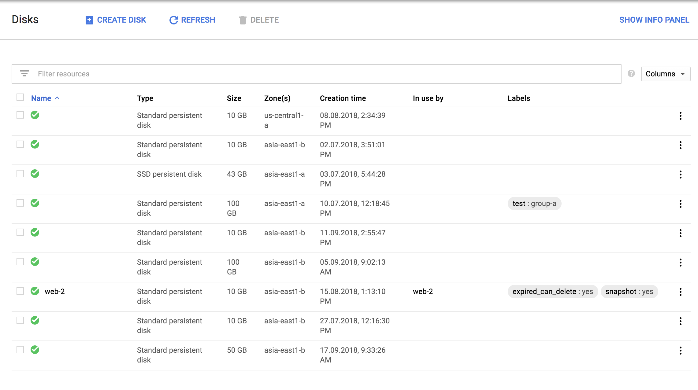
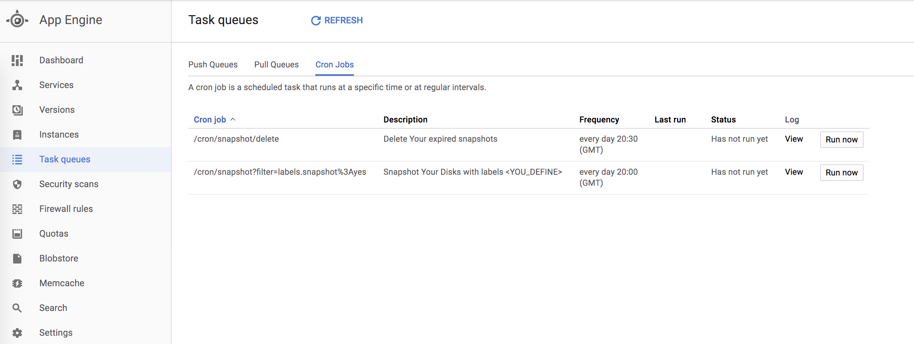
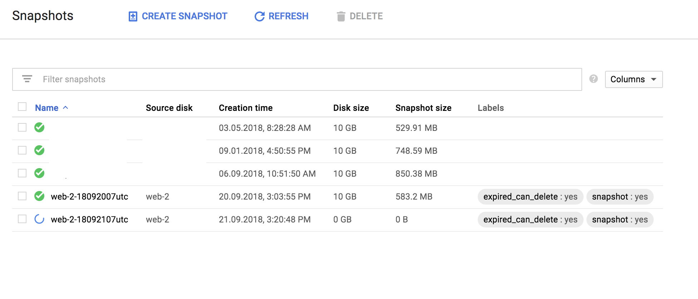

# gae_snapshot_disk
Snapshot GCE Instance Disks with GAE Cron Job and Delete Expired Snapashots

## Get Source Code
```shell
$ git clone git@github.com:CloudMile/gae_snapshot_disk.git
```

## Install gcloud SDK
Follow [here](https://cloud.google.com/sdk/install) to install gcloud SDK

## Creat/Use a GAE Project on GCP
Follow [here](https://console.cloud.google.com/projectselector/appengine/create?lang=go&st=true) to select/create a GCP project.

## Setup
go to source dir
```shell
$ cd ./gae_snapshot_disk
```
you have to setup `app.yaml`, `cron.yaml` and `queue.yaml`

edit `app.yaml`
```shell
$ vim app.yaml
```
```yaml
service: snapshot
env_variables:
  PROJECT_ID: "<YOUR_PROJECT_ID>" # only work for localhost test
  DAYS_AGO: '7' # delete snapshots 7 days ago
```
- service, if this is your first GAE service, please change to `default`
- PROJECT_ID, GCP project, it's only work on local
- DAYS_AGO, how many days ago, the snapshots will be deleted.

edit `cron.yaml`
```shell
$ vim cron.yaml
```
```yaml
target: snapshot
```
- target, if this is your first GAE service, please change to `default`

You can add more cron case you need.
You can add query string to filter (`?filter=labels.<LABEL_KEY>%3A<LABEL_VALUE>`) for disk which you do want to snapshot. also the disk which doesn't set label will not be snapshoted.

For the disk which set the label `expired_can_delete:yes`; this service will delete the snapshot after days you set `DAYS_AGO`.

edit `queue.yaml`
```shell
$ vim queue.yaml
```
```yaml
target: snapshot
```
- target, if this is your first GAE service, please change to `default`

## Deploy
```shell
$ gcloud config set project <YOUR_PROJECT_ID>
```
`<YOUR_PROJECT_ID>` change to your project id
```
$ gcloud app deploy app.yaml cron.yaml queue.yaml
```

## Test
Go to GCP console GCE disk page
you can set lable for disk which you do want to snapshot.


Go to GAE page -> Task queues
chick the `run now` for test


GO to GCE snapshot page
the snapshot will create.

